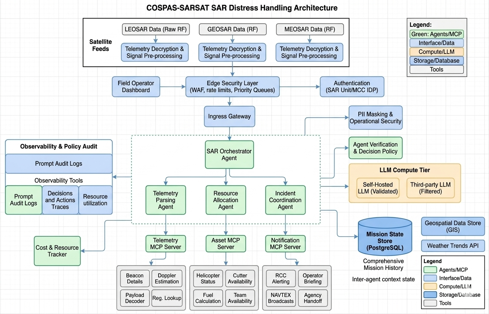

# COSPAS-SARSAT Multi-Agent Search & Rescue (SAR) Operational System



A containerized geospatial telemetry processing platform and real-time incident command interface for simulating search-and-rescue operations. The platform ingests simulated **406MHz satellite distress bursts** over an Apache Kafka event bus, evaluates them using a **LangGraph multi-agent orchestration engine**, generates natural-language incident summaries through a local **Ollama LLM compute tier**, and maintains situational awareness in a **PostGIS spatial database**.

The stack is fully containerized and uses the **Model Context Protocol (MCP)** over stdio to decouple agent decision-making from infrastructure tools.

---

## System Architecture & Data Topology

```text
[ simulate_satellite_stream.py ]
              │  (HMAC-SHA256 signature verification)
              ▼
    [ Apache Kafka Broker ] ─── (Topic: satellite-ingress-raw)
              │
              ▼
 [ sar-ingestion-worker (Docker) ]
              │
              ├─► [ Edge Gateway Firewall ] ─── (Origin validation)
              │
              ├─► [ LangGraph Orchestrator Engine ]
              │            │
              │            ▼ (JSON-RPC over stdio)
              │       [ MCP Host Manager Client ]
              │            │
              │            ├──► [ telemetry-parser ] ──► (Doppler parsing)
              │            ├──► [ asset-allocator ]  ──► (Asset distance calc)
              │            └──► [ incident-coordinator ] ──► [ PostGIS Data Layer ]
              │                                               (Spatial upserts)
              ▼
    [ Ollama LLM Compute ] ─── (Model: qwen2.5:1.5b, kept warm in RAM)
              │
              ▼
 [ Shared Volume Directory ] ─── (Path: core_audit_logs/incident_*.json)
              │
              ▼
 [ sar-operator-dashboard ] ─── (Streamlit console, port 8501)
   (5s auto-refresh / lock-free file reads)
```

---

## Component Overview

- **`sar-operator-dashboard` (`app.py`)** — Streamlit-based operator console. Auto-refreshes every 5 seconds, reads shared log files without locking (so it won't stall while the worker writes new data), aggregates live PostGIS data, compiles maritime NAVTEX-style text summaries, and includes a database/Kafka offset purge utility.
- **`sar-ingestion-worker` (`core_ingestion/worker.py`)** — Containerized ingestion daemon running a continuous `KafkaConsumer` loop. Decodes incoming payloads, verifies origin signatures, drives multi-agent decision steps via LangGraph, hands off summary generation to Ollama on a background thread, and keeps output files schema-consistent.
- **`sar-llm-compute` (Ollama container)** — Self-hosted LLM engine running **Qwen 2.5 (1.5B)**, configured with a 30-minute keep-alive so the model stays resident in memory for fast CPU inference.
- **`mcp_servers/`** — Independent microservices built on `FastMCP`. Each registers tool schemas (e.g. `update_mission_status`, `broadcast_incident_alerts`) and exposes them to the orchestrator over stdio.
- **`simulate_satellite_stream.py`** — Simulation engine that broadcasts randomized distress packets with configurable spatial drift, representing vessels adrift at sea.

---

## Project Directory Structure

```text
sar-mcp-system/
│
├── core_ingestion/           # Ingestion and security processing
│   ├── worker.py             # Main stream consumer & cleanup loop
│   └── security.py           # HMAC authentication & input sanitization
│
├── core_orchestrator/        # Multi-agent decision logic
│   ├── orchestrator.py       # LangGraph mission-state pipeline
│   ├── mcp_client_host.py    # Async-managed MCP stdio client
│   └── audit_logger.py       # JSON audit logging utilities
│
├── mcp_servers/              # MCP server tier
│   ├── asset_server/         # Fleet distance & asset allocation tools
│   ├── incident_server/      # PostGIS writer & alert broadcaster tools
│   └── telemetry_server/     # Satellite payload parsing & frequency tracking
│
├── core_audit_logs/          # Shared volume for JSON audit traces
│
├── app.py                    # Streamlit dashboard entry point
├── mcp_config.json           # MCP server registry (commands/args)
├── style.css                 # Dashboard styling
│
├── init_kafka_topics.py      # Kafka topic setup
├── init_db_schema.py         # PostGIS schema & spatial index setup
├── seed_assets.py            # Baseline fleet resource seeding
├── simulate_satellite_stream.py  # Distress message simulator
│
├── docker-compose.yml        # Container orchestration config
├── Dockerfile.dashboard      # Operator panel image
├── Dockerfile.worker         # Consumer worker image
└── requirements.txt          # Shared dependencies
```

---

## Setup & Deployment

### 1. Create the shared log volume
```bash
mkdir -p core_audit_logs
```

### 2. Build and start the container stack
```bash
docker compose down -v
docker compose up --build -d
```
Verify that all services report `running` or `healthy` before continuing.

### 3. Provision Kafka topics, database schema, and seed data
```bash
python init_kafka_topics.py
python init_db_schema.py
python seed_assets.py
```

### 4. Pull and warm the local LLM
```bash
docker exec -it sar-ollama-engine ollama run qwen2.5:1.5b "Initialize SAR Operator Mode"
```
Once the model responds, press `Ctrl+D` to detach. The model stays cached in the container.

### 5. Start the simulation stream
```bash
python simulate_satellite_stream.py
```
This broadcasts a signed distress transmission every 8 seconds.

### 6. Open the dashboard
```
http://localhost:8501
```

---

## Operational Notes

### Anti-spoofing
Every message on `satellite-ingress-raw` must carry a valid **HMAC-SHA256** signature in the `mcc-signature` header. Messages that are missing a token, fail verification, or contain unsanitized fields are dropped at the edge gateway.

### Log/offset purge
The **Purge System Logs** button on the dashboard sidebar drops the relevant database tables and clears historical logs. Since Kafka doesn't support deleting messages from a topic directly, it uses `consumer.seek_to_end()` to advance the consumer group past the existing backlog instead, then recreates a clean `core_audit_logs/` directory.

### Lock-free dashboard reads
`app.py` reads shared log files without locking. If the worker is mid-write during an auto-refresh cycle, the dashboard catches the resulting `IOError`/`JSONDecodeError`, skips that frame, and continues rendering without blocking the UI.

### Non-blocking report generation
Ollama-based summary generation runs on a background thread in the ingestion worker, so LLM inference doesn't block Kafka message consumption or delay processing of the next incoming distress signal.
